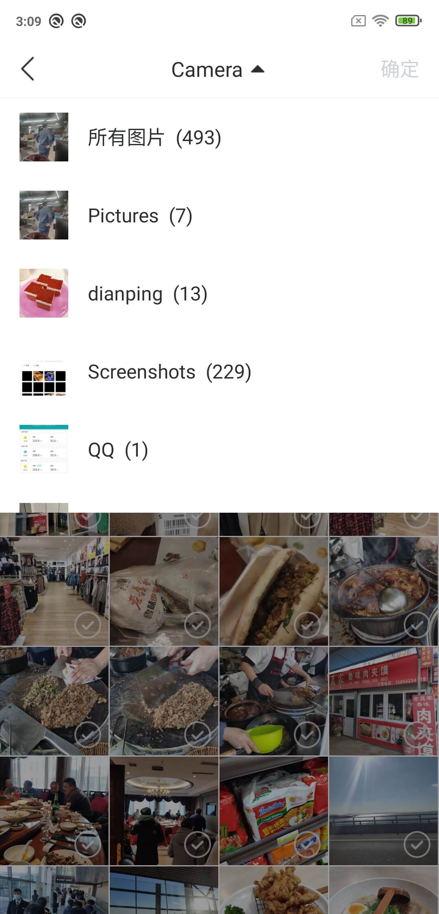

# DaVinci

一个好用的安卓图片选择/预览库，结合Matisse与PhotoPicker的优点而成。

### 效果预览

|||||
|---|---|---|---|

### 注意
* 最低支持版本为Android5.0（minSdkVersion 21）
* 本项目仅提供AndroidX版本
* 网络图预览暂未支持，预计下版本开放

### 特点
* 支持是否显示GIF
* 支持修改图片最大选择数
* 支持修改图片展示列数
* 支持默认选中图片
* 构建者模式链式调用
* ......

### 基本用法
**Step 1. 添加mavenCentral仓库**
在项目根目录下的 `build.gradle` 中添加仓库:
``` gradle
allprojects {
    repositories {
        ...
        mavenCentral()
    }
}
```
**Step 2. 添加项目依赖**
``` gradle
dependencies {
    implementation 'io.github.csdn-mobile:DaVinci:0.1.2'
}
```
**Step 3. 在Activity中添加代码**
```
// 图片选择
DaVinci.select()
        .showGif(true)  // 是否显示GIF
        .showCamera(true)   // 是否显示相机图标
        .column(4)  // 图片展示列数
        .selectedPhotos(xxx) // 默认选中图片，ArrayList<String>格式
        .start(this, 10000);

// 图片预览
DaVinci.preview()
        .previewPhotos(xxx) // 需要展示的图片，ArrayList<String>格式
        .start(this);
……
```

### 未来计划
* 支持网络图片预览
* 支持更多样式自定义

### 版本记录
|版本号|更新内容|
|---|---|
|0.1.2|Fix bug|
|0.1.0|First Version|

