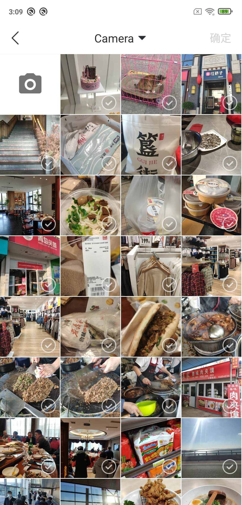

# DaVinci

一个好用的安卓图片选择/预览库，结合Matisse与PhotoPicker的优点而成。

### 效果预览

||||
|---|---|---|
|||

### 注意
* 最低支持版本为Android5.0（minSdkVersion 21）
* 本项目仅提供AndroidX版本

### 特点
* 支持预览网络图片
* 支持预览识别二维码
* 支持预览保存网络图片
* 支持是否显示GIF
* 支持修改图片最大选择数
* 支持修改图片展示列数
* 支持默认选中图片
* 支持长图预览
* 构建者模式链式调用
* ......

### 基本用法
**Step 1. 添加mavenCentral仓库**
在项目根目录下的 `build.gradle` 中添加仓库:
``` gradle
allprojects {
    repositories {
        ...
        mavenCentral()
    }
}
```
**Step 2. 添加项目依赖**
``` gradle
dependencies {
    implementation 'io.github.csdn-mobile:DaVinci:0.7.2'
}
```
**Step 3. 在Activity中添加代码**
```
// 图片选择
DaVinci.select()
        .showGif(true)  // 是否显示GIF
        .showCamera(true)   // 是否显示相机图标
        .column(4)  // 图片展示列数
        .selectedPhotos(xxx) // 默认选中图片，ArrayList<String>格式
        .start(this, 10000);

// 图片预览（简洁设置）
DaVinci.preview()
        .previewPhotos(xxx) // 需要展示的图片，ArrayList<String>格式
        .start(this);
        
// 图片预览（复杂设置）
DaVinci.preview()
        .previewPhotos(xxx) // 需要展示的图片，ArrayList<String>格式
        .saveFolderName("CSDN") // 长按保存图片的文件夹名称，默认CSDN
        .needQrScan(true) // 是否需要识别二维码，默认true
        .qrScanCallback(new DaVinci.QrSacnCallback() {
            @Override
            public void onResult(String result) {
                // 长按识别二维码的回调，可以不设置
            }
        })
        .start(this);
……
```

### 未来计划
* 支持更多样式自定义
* 优化架构
* 权限获取逻辑优化

### 版本记录
|版本号|更新内容|
|---|---|
|0.7.2|Add permission request Dialog|
|0.5.0|Optimize preview long pictures|
|0.4.6|Fix bug and switch to PhotoView|
|0.3.0|Support save network picture and analyse QR Code|
|0.2.0|Support preview network pictures|
|0.1.5|Fix bug|
|0.1.0|First Version|

